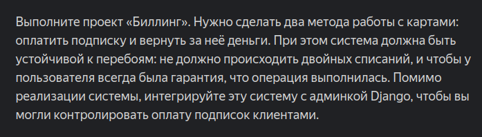
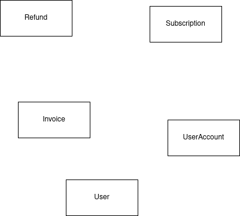
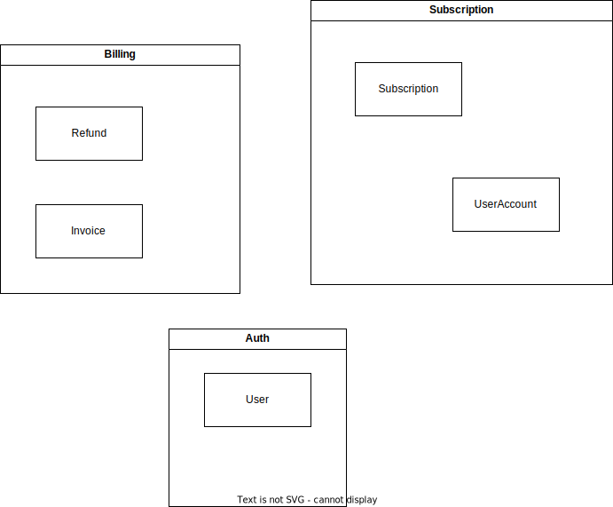
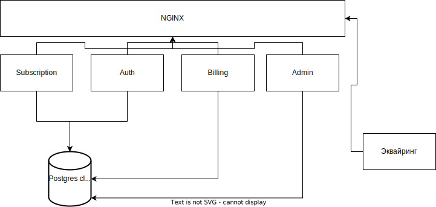
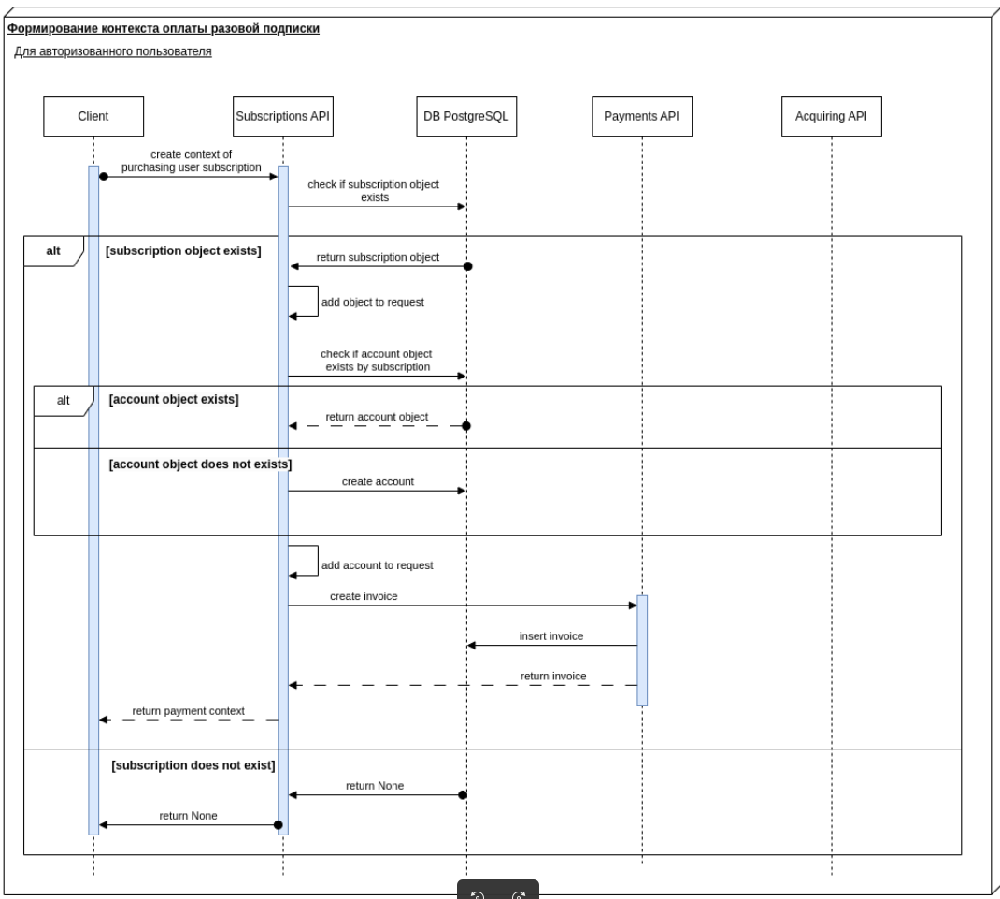
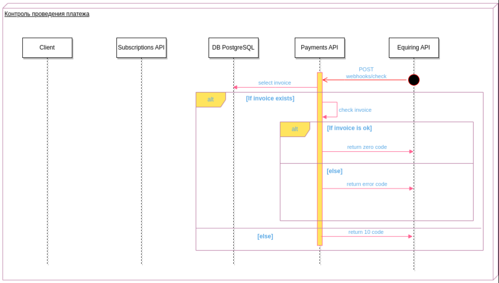
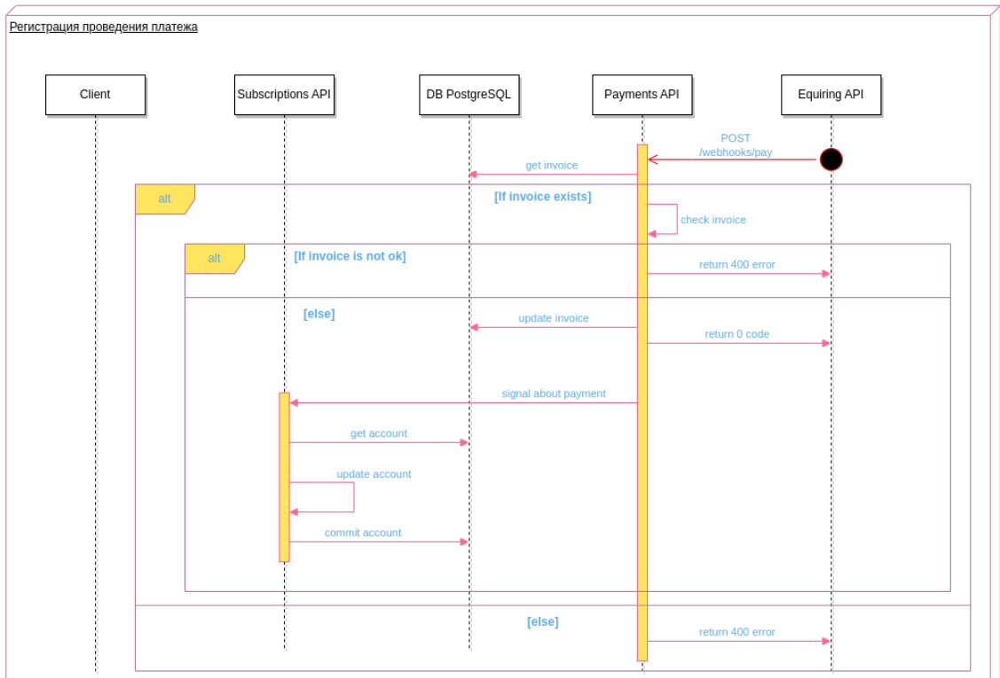

### Movix Billing Service

Яндекс.Практикум, 25 Когорта, 7 команда

<br>

##### Состав команды

-   Станислав Богацкий, team lead, [github](https://github.com/sbkubric)
-   Виктор Гостяйкин, разработчик, [github](https://github.com/Viktor-Gostyaikin)
-   Сергей Колтунов, разработчик, [github](https://github.com/dogbusiness)

note: Всем привет!

Наш дипломный проект - billing.

Начну с того, как мы пришли к тому сервису, который получился.

h---

### Как всё начиналось...

План в моей голове:


note: План был хорош: читаем постановку задач, декомпозируем и раскидываем таски, кодим сервис, всё будет в шоколаде.

h---

### Хотелки бизнеса



note: Реальность оказалась более суровой.

h---

### А что делать?


note: Формулировки были общими, и их было мало.

Что делать? Я решил сформулировать четко функциональные требования.

[comment]: <> (Слайд для фразы "Для начала установим бизнес-требования и сформируем функциональные)
h---

### Cформируем список требований:

-   Проводить платежи
-   Делать рефанды
-   Контролировать платежи с помощью админки
-   Легкая интеграция эквайринга без рефакторинга

note: Наш сервис должен уметь:

-   проводить платежи
-   Проводить рефанды
-   контролировать состояние платежа через админку
-   легко интегрировать разные эквайринги без серьезных доработок.

После этого стало ясно, что у нас есть глобально 3 юзер-стори.

h---

### Подписка

Я пользователь. Я хочу:

-   Я жму "Оплатить подписку"
-   Попадаю на форму с выбором метода оплаты
-   Ввожу платежные данные
-   Жму "оплатить"
-   Вижу статус платежа
-   Иду смотреть кино 🎥
    note: подписка

h---

### Возврат

Я пользователь. Я хочу:

-   Я жму на кнопку "Отменить подписку"
-   Подтверждаю своё решение
-   Получаю письмо о возврате средств
    note: возврат

h---

### Контроль платежей

Я администратор. Я хочу:

-   Видеть статус подписки у пользователя
-   Видеть информацию по платежам: время совершения транзакции, срок подписки, тип платежа
    note: контроль платежей

h---

[comment]: <> (Сервисы)

### Отлично, требования есть. А как делать будем?


note: После определения бизнес требований надо было определить архитектуру сервиса.

h---

### Что нам вообще нужно?



note: Решение принималось, исходя из того, какие сущности у нас есть в системе:

-   платеж
-   подписка
-   возврат
-   аккаунт пользователя
-   пользователь

h---

### Кажется, одним сервисом дело не ограничится



note: Было принято решение разделить эти сущности на несколько микросервисов, т.к. до этого мы использовали микросервисную архитектуру.

Таким образом появились два новых сервиса billing и subscription.

h---

### Прикидываем архитектуру сервисов


note: Было решено, т.к. времени оставалось немного, сосредоточится на биллинге, а subscription делать по остаточному принципу.

Опираясь на принятые решения была проработана вот такая архитектура.
h---

### А что с эквайрингом?


note: В качестве эквайринга был выбран cloudpayments
h---

### Идемпотентность и автоматы


note: Ещё нужно было обеспечить идемпотентность и транзакционность всех операций биллинга. По совету эксперта мы решили использовать для этого конечные автоматы.
h---

### Библиотека transitions


[pytransitions/transitions](https://github.com/pytransitions/transitions)

note: В качестве реализации взяли библиотеку transitions. Примеры кода будут чуть дальше.
h---

### Технологии

-   psycopg3
-   FastAPI
-   Django
-   pytransitions/transitions
-   sqlalchemy2
-   pydantic
-   orjson

note: Исходя из этого, получилось сформировать список технологий, которые нам нужны.

h---

### Данные


note: Теперь можно и приступить к написанию кода.
Начали мы с описания структур данных.
h---

### Схема данных: биллинг


note: Привет, я - Сергей.
Я хочу рассказать про схему данных для сервиса биллинга.

У нас есть три сущности: Invoice, Refund, Acquiring_log

В Invoice хранятся платежи, созданные subscription-api.
Для связи с эквайрингом используются атрибуты transaction_id, invoice_id и acq_provider.
Сочетание acq_provider и transcation_id является уникальным идентификатором платежа со стороны эквайринга.
В поле info может храниться дополнительная мета-информация об эквайринге и платеже.

В Refund ведутся возвраты платежей.
Возврат невозможен без существующего платежа, поэтому здесь есть FK для invoice_id.
Для связи с эквайрингом используется атрибуты invoice_id, transaction_id и acq_provider.

Таблица acquiring_log предназначена для фиксации всех транзакций, проходящих в эквайринге.
Там мы записываем любую транзакцию и все возможные данные, получаемые от эквайринга:
номер транзакции, код который он нам вернул и сообщение.
Эти данные попадают ещё в и ELK стек, таблица нужна для дополнительной надежности.

h---

### Схема данных: подписки


h---

### Что происходит при подписке?


note: Привет, я - Виктор. Я расскажу о том, как реализована бизнес-логика оплаты услуг в нашем кинотеатре.

Выбирая эквайринг. мы остановились на CloudPayments, т.к. уже был зерегистрирован личный кабинет + это современный эквайринг с полным набором функций.

Cloudpayments предоставляет свой SDK, виджеты и API для интеграций. Уведомление магазина происходит при помощи вебхуков..

Интересной особенностью этого эквайринга является то, что формирование платежа происходит при помощи виджета, т.е. не требуется редирект на сайт эквайринга.
Вместо этого мы формируем у себя платеж, после чего передаем на клиент данные платежа.
Клиент показывает пользователю виджет, поставляемый эквайрингом, для оплаты.

h---

### Детальные схемы хуков платежа

  <div style="display: flex; flex-direction: row;">
    
    
  </div>

note: После того как виджет отправит эквайрингу данные о платеже, эквайринг обратится к нашему бэкенду для проверки платежа.
После успешной проверки данных, эквайринг спишет средства у пользователя, и еще раз вызовет наш сервер, чтобы сообщить статус платежа.
При успешном завершении платежа, или при ошибке дергается вебхук сервиса подписок, который уведомляет пользователя и сервис авторизации, если подписка успешно продлена.

h---

### Что происходит при возврате


note: Я решил объединить вебхук от эквайринга и универсальный эндпоинт от нашего subscriptions-api в одну схему.

Сначала успешный сценарий:
От клиента передается запрос на возврат в subscriptions-api, затем по внутреннему эндпоинту в биллинг.
Биллинг находит платеж по которому хотят сделать возврат и создает запись в таблицу Refund. На этом же этапе проверяем есть ли уже возврат по этому платежу.
Если все хорошо, создаем платеж в статусе pending и отправляем эквайеру.
Если эквайер ответил чем-то кроме 200, фейлим платеж (меняем статус на фейлд) и заносим невыполненную транзакцию в acquiring_log.

h---

### Процесс биллинга

```python3
class BillingProcessABC(asyncio.AsyncMachine, mixins.TableMixin, abc.ABC):
    def __init__(
        self, *args, aquiring_provider: protocols.AcquiringProviderProtocol, **kwargs
    ):
        self._transaction_id: str | None = None
        self._status: str | None = None
        self._session: asql.AsyncSession | None = None
        self._locked_entry: db.Invoice | db.Refund | None = None
        self._entry_id: uuid.UUID | None = None
        self._acquiring_provider: protocols.AcquiringProviderProtocol = (
            aquiring_provider
        )
        super().__init__(*args, **kwargs)

    async def _before_change(self, event: transitions.EventData):
        if not self.table is None or (
            self._entry_id is None and self._transaction_id is None
        ):
            return

        self._session = db_session.get()
        if self._entry_id:
            result = await self._session.execute(
                sql.Select(self.table)
                .where(self.table.id == self._entry_id)
                .with_for_update()  # TODO : explore timeout possibilites
            )
            self._locked_entry = typing.cast(
                db.Invoice | db.Refund | None, result.one_or_none()
            )
            return

        result = await self._session.execute(
            sql.Select(self.table)
            .where(
                sql.and_(
                    self.table.aquiring_provider == self._acquiring_provider.title,
                    self.table.transaction_id == self._transaction_id,
                )
            )
            .with_for_update()
        )
        self._locked_entry = result.one_or_none()  # type: ignore

    async def get_pid(self) -> uuid.UUID:
        if self._entry_id is None:
            raise exc.NotFoundError
        return self._entry_id

    async def _after_change(self, event: transitions.EventData):
        if (
            self._entry_id is None
            or self._session is None
            or self._locked_entry is None
        ):
            return
        await self._session.commit()
        self._session = None
        self._locked_entry = None

    async def _store(self, event: transitions.EventData):
        if self._entry_id is None or self._locked_entry is None:
            raise exc.LogicError
        self._locked_entry.process = pickle.dumps(self)
        statement = sql.update(self.table).where(self.table.id == self._entry_id)
        await self._session.execute(statement, (self._locked_entry,))  # type: ignore

    @abc.abstractmethod
    async def on_exception(self, event: transitions.EventData):
        ...
```

note: Наконец, переходим к финалу истории, что же в итоге получилось.
Перед вами процесс биллинга, родительским объект для всех транзакций в нашей системе.
В начале каждой транзакции происходит выборочная блокировка таблицы бд, с которой работаем. Блокировка происходит либо по ID, либо по ID транзакции эквайринга и самому эквайрингу.

После того, как мы закончили работу с таблицей, мы сохраняем процесс и отпускаем блокировку с помощью коммита.
h---

### Процесс платежа

```python
class InvoiceProcessABC(BillingProcessABC, mixins.InvoiceTableMixin, abc.ABC):
    def __init__(self, *args, **kwargs):
        states = enums.InvoiceStates
        self._locked_entry: db.Invoice | None = None
        self.table = self.__class__.table
        super().__init__(
            self,
            *args,
            states=states,
            initial=enums.InvoiceStates.NONE,
            send_event=True,
            before_state_change=self._before_change,
            after_state_change=self._after_change,
            **kwargs,
        )
        self.add_transition('store', list(enums.InvoiceStates), '=', after=self._store)
        self.add_transition(
            'create',
            enums.InvoiceStates.NONE,
            enums.InvoiceStates.CREATED,
            before=self._before_create,
            after=self._after_create,
        )
        self.add_transition(
            'check',
            enums.InvoiceStates.CREATED,
            enums.InvoiceStates.PENDING,
            before=self._before_check,
            after=self._after_check,
            conditions=self._is_locked,
        )
        self.add_transition(
            'pay',
            enums.InvoiceStates.PENDING,
            enums.InvoiceStates.PAID,
            before=self._before_pay,
            after=self._after_pay,
            conditions=self._is_locked,
        )
        self.add_transition(
            'cancel',
            [enums.InvoiceStates.CREATED, enums.InvoiceStates.PAID],
            enums.InvoiceStates.CANCELED,
            before=self._before_cancel,
            after=self._after_cancel,
            conditions=self._is_locked,
        )
        self.add_transition(
            'fail',
            [enums.InvoiceStates.CREATED, enums.InvoiceStates.PAID],
            enums.InvoiceStates.FAILED,
            before=self._before_fail,
            after=self._after_fail,
            conditions=self._is_locked,
        )

    def _is_locked(self) -> bool:
        return bool(self._locked_entry)

```

note: В процессе платежа интересно посмотреть на инициализацию машины. Мы передаем состояния либо в виде списка строк, либо в виде enuma, затем определяем начальное состояние. После инициализации машины мы можем прикреплять к ней transition для перехода между стейтами.

h---

### Процесс возврата

```python
class RefundProcessABC(mixins.RefundTableMixin, BillingProcessABC, abc.ABC):
    table = db.Refund

    def __init__(self, *args, **kwargs):
        states = enums.RefundStates
        self._locked_entry: db.Refund | None = None
        super().__init__(
            self,
            *args,
            states=states,
            initial=enums.RefundStates.NONE,
            send_event=True,
            before_state_change=self._before_change,
            after_state_change=self._after_change,
            **kwargs,
        )
        self.add_transition('store', list(enums.InvoiceStates), '=', after=self._store)
        self.add_transition(
            'create',
            enums.RefundStates.NONE,
            enums.RefundStates.CREATED,
            before=self._before_create,
            after=self._after_create,
        )
        self.add_transition(
            'register',
            enums.RefundStates.CREATED,
            enums.RefundStates.PENDING,
            before=self._before_register,
            after=self._after_register,
            conditions=[self._is_locked],
        )
        self.add_transition(
            'refunded',
            enums.RefundStates.PENDING,
            enums.RefundStates.REFUNDED,
            prepare=self._lock,
            before=self._before_refund,
            after=self._after_refund,
            conditions=self._is_locked,
        )
        self.add_transition(
            'fail',
            [enums.RefundStates.CREATED, enums.RefundStates.PENDING],
            enums.RefundStates.FAILED,
            prepare=self._lock,
            before=self._before_fail,
            after=self._after_fail,
            conditions=self._is_locked,
        )

    async def _find_acquirer(self, event: transitions.EventData):
        ...

    def _is_locked(self, *args, **kwargs) -> bool:
        return bool(self._locked_entry)
```

note: Процесс рефанда выглядит аналогично платежу.

h---

[comment]: <> (Демо)

### А теперь смотрим!

[Демка биллинга]()

h---

### Что не успели?

-   сервис подписок (готов только barebone и пара эндпойнтов)
    note: Не успели сделать сервис подписок, потому что там своя большая логика и соответственно интеграция с сервисом нотификации авторизации готовы лишь частично.

h---

### Что можно улучшить?

-   рекуррентные платежи
-   Event-driven общение между сервисами

note: Можно было бы добавить фичи регулярных платежей и шину данных для событийной модели, как в сервисе нотификаций.

h---

### Вопросы?
